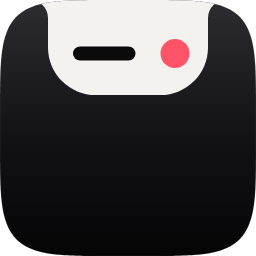
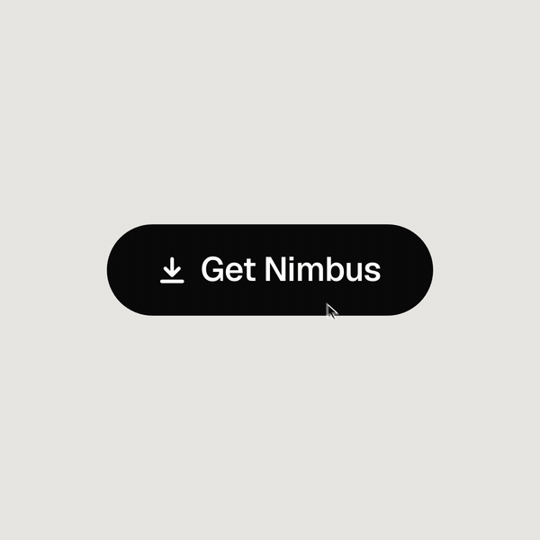
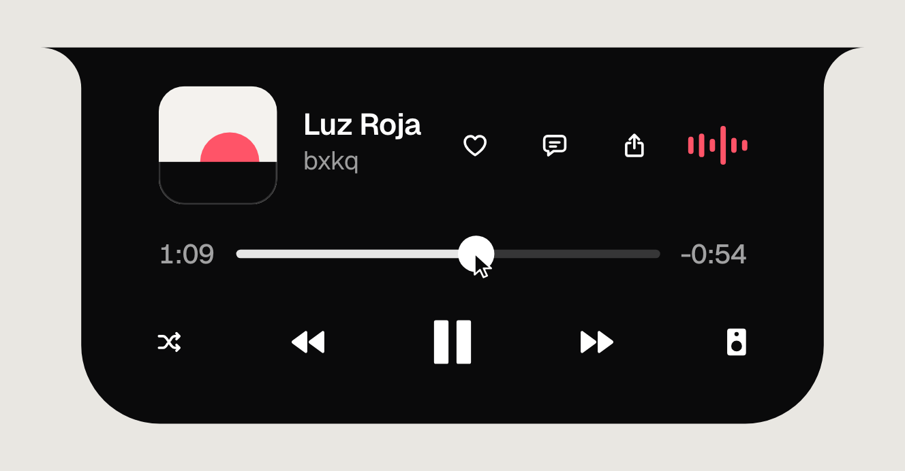
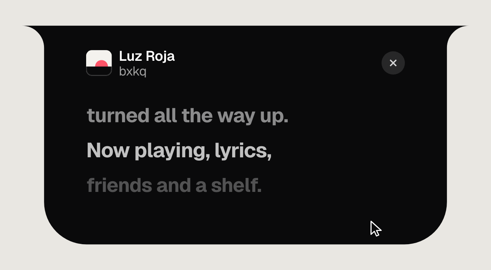
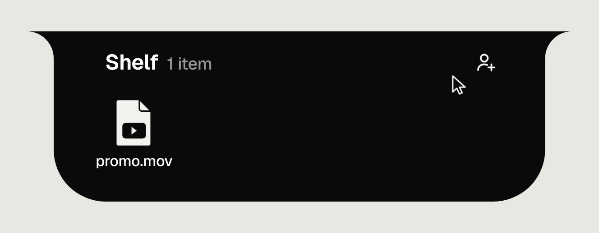
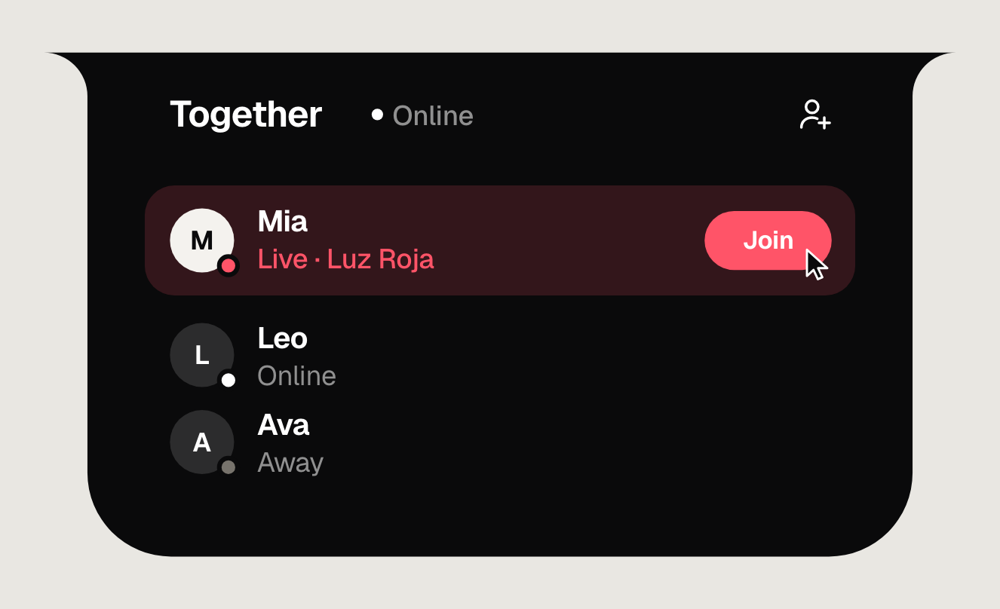

# Nimbus

### Your notch, turned all the way up.

What's playing, the lyrics being sung, the files you need next, 
and your friends, listening along. In the space your screen already gives you.

 

[**Download for Mac**](https://github.com/Superior-curtis/nimbus-releases/releases/latest) &nbsp;·&nbsp;
[**Download for Windows**](https://github.com/Superior-curtis/nimbus-releases/releases/tag/windows-v2.9.2) &nbsp;·&nbsp;
[**Open in your browser**](https://nimbus-mac.web.app/account)

 

 

 

## The notch was always wasted space

Every MacBook has a black cutout at the top of the screen that does nothing. Nimbus turns it into an island that knows what you're doing: it opens when you hover, shows what matters for that moment, and tucks away when you're done. No window, no dock icon, no clutter.

On a Mac without a notch, or on Windows, Nimbus draws the same island at the top of your screen.

 

<table>
<tr>
<td width="50%"></td>
<td>

### 🎧 Now Playing, wherever it's playing

Spotify, Apple Music, YouTube in a browser: one card for all of it. Artwork, a scrub bar you can drag, play/pause and skip. It picks up whatever your system is playing, so there's nothing to connect.

</td>
</tr>
<tr>
<td>

### 🎤 Lyrics, line by line

Synced lyrics light up as they're sung. Open the lyrics pane and the song fills the island. Click any line to jump to it.

</td>
<td width="50%"></td>
</tr>
<tr>
<td width="50%"></td>
<td>

### 📥 The Shelf holds things for you

Drag a file, an image or a link to the top of your screen and let go. It waits in the notch until you drag it back out, even after a restart. On the Mac, drop it on the left to AirDrop it, or keep the Shelf in iCloud Drive so your iPhone sees it too.

</td>
</tr>
<tr>
<td>

### 🔴 Together: listen with your friends, live

Go live and your friends hear exactly what your computer is playing, with the song, artwork and lyrics on their screen. Chat, send files, and see who's online, all from the notch. Your friends can join from a Mac, a PC or **just a browser on their phone**, with nothing to install.

</td>
<td width="50%"></td>
</tr>
</table>

 

## And the small things

- **Volume and brightness** show up in the island instead of the system pop-up.
- **Face Unlock** (Mac) unlocks with your face whenever the lock screen wakes.
- **Clipboard history, calendar, focus timer** (Mac), one swipe away.
- **Favorites and listening history** land in real Apple Music or Spotify playlists.
- **Updates itself.** Every new version arrives on its own.

 

## Get it

| | | |
|---|---|---|
| **Mac** | macOS 13 Ventura or newer · Apple silicon & Intel | [Download the .dmg](https://github.com/Superior-curtis/nimbus-releases/releases/latest) |
| **Windows** | Windows 10 (2004+) or 11 · x64 & ARM | [Download the .exe](https://github.com/Superior-curtis/nimbus-releases/releases/tag/windows-v2.9.2) |
| **Any browser** | Together only: chat, friends, listen to a Live | [Open Nimbus Together](https://nimbus-mac.web.app/account) |

<b>First launch on Mac: "Nimbus can't be opened"</b>

 

Nimbus isn't notarized by Apple yet, so macOS blocks the very first launch.

1. Drag **Nimbus** into **Applications**.
2. **Right-click** Nimbus → **Open** → **Open**.

That's once. If macOS still refuses: **System Settings → Privacy & Security → Open Anyway**. The [install guide](https://nimbus-mac.web.app/install) shows each step.

<b>First launch on Windows: "Windows protected your PC"</b>

 

Nimbus isn't code-signed yet, so SmartScreen warns about it once. Click **More info → Run anyway**. There's nothing to install; it runs straight from the .exe and sits in the tray.

 

## Questions

**Is it really free?** Yes. No subscription, no upsell inside the app.

**Do I need an account?** Only for Together. The island, Now Playing, lyrics and the Shelf work without one.

**What does Together send?** Chat, your friend list, and, only while you're live, the audio your computer plays, to friends you've added. Lyrics come from [LRCLIB](https://lrclib.net), an open lyrics database.

**Forgot your password?** Choose *Forgot password* when you sign in. The code appears on your devices that are still signed in.

More in the [FAQ](https://nimbus-mac.web.app/faqs) · what's new in the [changelog](https://nimbus-mac.web.app/changelog).

 

**[nimbus-mac.web.app](https://nimbus-mac.web.app)**

Made by Superior Curtis · Found a bug? <a href="https://github.com/Superior-curtis/nimbus-releases/issues">Open an issue</a>.

